# AI Code Master · AI 零代码应用构建平台

> 一个企业级的零代码生成平台，仅需输入自然语言，就可以快速构建并部署一个可访问的 Web 应用。

<p align="center">
  
  
  
  
  
  
  
  
</p>

- **在线体验**：http://111.230.6.113/
- **开发语言**：Java（后端）+ JavaScript（前端）
- **核心定位**：基于 Spring Boot 3 + LangChain4j 的 AI 零代码应用生成平台

**目录**

1. [项目介绍](#一项目介绍)
2. [核心功能](#二核心功能)
3. [技术栈](#三技术栈)
4. [系统架构](#四系统架构)
5. [核心业务流程](#五核心业务流程)
6. [数据库设计](#六数据库设计)
7. [关键技术设计与亮点](#七关键技术设计与亮点)
8. [许可证与致谢](#八许可证与致谢)

---

## 一、项目介绍

这是一个 **AI 零代码应用构建平台**：用户无需编写任何代码，只需输入自然语言描述，AI Agent 就会自动完成「需求分析 → 生成策略路由 → 代码生成 → 质量检查 → 项目构建 → 一键部署」的完整工作流，最终产出一个可直接访问的 Web 应用。

区别于传统「增删改查」类项目，本项目聚焦 **AI 智能体（Agent）开发、AI 工作流、工具调用机制** 等前沿方向，覆盖从 AI 应用层到底层工程化的完整技术链路。

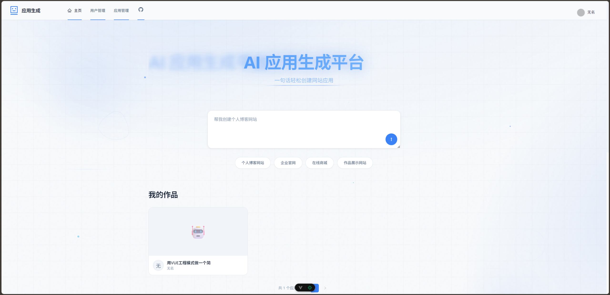

平台首页提供了「一句话创建」的核心交互：输入需求描述，或点击「个人博客 / 企业官网 / 在线商城 / 作品展示」等快捷标签，即可快速开始生成。

---

## 二、核心功能

平台围绕「AI 生成 → 可视化编辑 → 部署分享 → 后台管理」四条主线，提供四大核心能力。

### 2.1 智能代码生成

用户输入需求描述后，AI 会先通过 **智能路由** 分析需求复杂度，自动选择合适的生成策略。支持三种生成模式：

| 生成类型 | 枚举值 | 适用场景 | 核心流程 |
| --- | --- | --- | --- |
| 原生 HTML 模式 | `html` | 简单展示页面 | AI 直接生成完整 HTML 单文件 |
| 原生多文件模式 | `multi_file` | 多页面、无复杂交互 | 生成 `index.html` + `style.css` + `script.js` |
| Vue 工程模式 | `vue_project` | 多页面 + 复杂交互 + 数据管理 | AI Agent 通过工具链自主创建完整 Vue 工程 |

**原生 HTML 模式**：左侧实时展示 AI 生成的代码（带语法高亮），右侧同步渲染预览，支持基于对话的持续迭代。

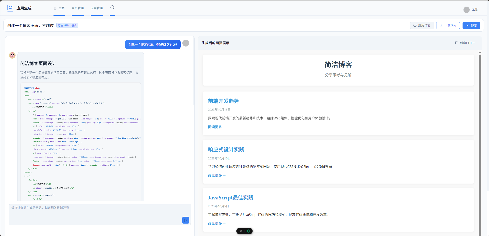

**Vue 工程模式**：AI 先生成「网站生成计划」和 `package.json` 依赖清单，再通过工具链逐文件创建工程结构，最终构建出可运行的多页面 Vue 应用。

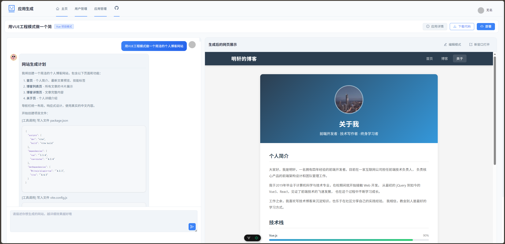

### 2.2 可视化编辑

生成的应用可进入 **可视化编辑模式**：悬浮查看页面元素、点击选中目标元素，直接用自然语言描述修改意图（如「把标题改得更醒目」），AI 理解意图后在代码层面完成变更，预览实时刷新。这是一种 **语义化编辑** 而非像素级编辑，用户无需了解任何 CSS 属性名。

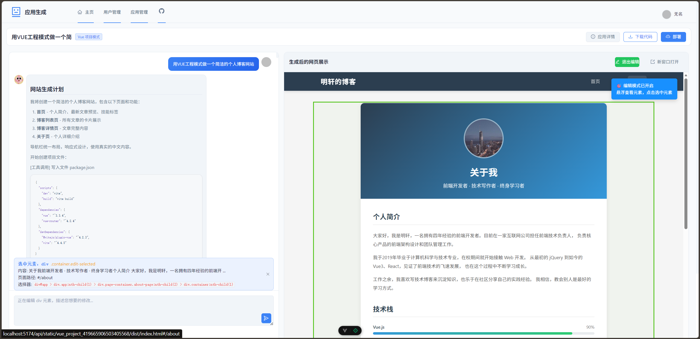

### 2.3 一键部署与分享

代码生成完毕后，平台自动完成 `npm install` + `npm run build` 构建，将产物复制到 Nginx 目录，通过 Selenium 自动截取封面图并上传至对象存储，最终基于 `deployKey` 生成可访问的分享链接。同时支持以 ZIP 形式下载完整项目源码。

### 2.4 企业级管理

提供后台管理能力，支持应用与用户的统一管理和检索。

**应用管理**：支持按名称 / 创建者 / 生成类型检索应用，提供编辑、精选（优先级排序）、删除等操作，以及部署状态跟踪。

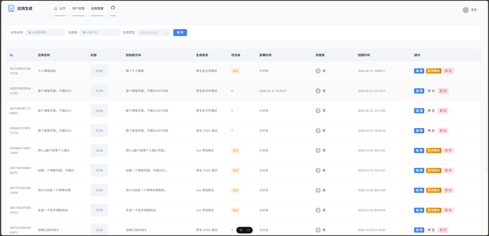

**用户管理**：支持按账号 / 用户名检索用户，展示用户角色（管理员 / 普通用户）并进行管理。

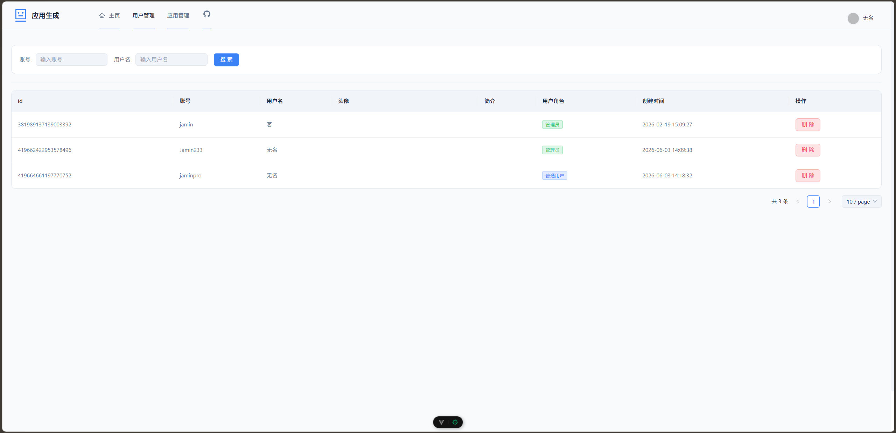

---

## 三、技术栈

### 3.1 后端技术栈

| 技术 | 版本 | 用途 |
| --- | --- | --- |
| Java | 21 | 开发语言（支持虚拟线程） |
| Spring Boot | 3.5.10 | 应用框架 |
| LangChain4j | 1.1.0 | AI 应用开发框架 |
| LangChain4j Reactor | 1.1.0-beta7 | 响应式编程支持 |
| LangChain4j OpenAI | 1.1.0-beta7 | OpenAI 协议模型集成 |
| LangChain4j Redis | 1.1.0-beta7 | Redis 对话记忆存储 |
| MyBatis-Flex | 1.11.1 | ORM 框架 |
| HikariCP | 4.0.3 | 数据库连接池 |
| MySQL | 8.0 | 关系型数据库 |
| Redis | - | 分布式缓存 + Session + 对话记忆 |
| Caffeine | - | 本地缓存（AI 服务实例缓存） |
| 腾讯云 COS | 5.6.227 | 对象存储（封面图、部署产物） |
| Selenium | 4.33.0 | 浏览器自动化截图 |
| WebDriverManager | 6.1.0 | 浏览器驱动自动管理 |
| Knife4j | 4.4.0 | API 文档 |
| Hutool | 5.8.38 | 通用工具库 |
| Lombok | 1.18.36 | 代码简化 |
| Spring Session Redis | - | 分布式 Session 管理 |
| Spring AOP | - | 权限校验与横切逻辑 |

### 3.2 前端技术栈

| 技术 | 用途 |
| --- | --- |
| Vue 3 | 前端框架（Composition API） |
| Vite | 构建工具 |

### 3.3 基础设施

| 技术 | 用途 |
| --- | --- |
| Nginx | 反向代理 + 静态资源服务 |
| Maven | 项目构建与依赖管理 |
| Git + GitHub | 版本控制 |

### 3.4 AI 能力

| 能力 | 实现方式 |
| --- | --- |
| AI 服务代理 | LangChain4j `AiServices.create()` 动态创建 |
| 智能体工具调用 | 自定义工具链（文件读写/修改/删除等） |
| 流式输出 | SSE（Server-Sent Events）+ 响应式编程 |
| 对话记忆 | `RedisChatMemoryStore` + `MessageWindowChatMemory` |

---

## 四、系统架构

### 4.1 分层架构

项目采用经典分层架构，各层职责清晰、单向依赖：

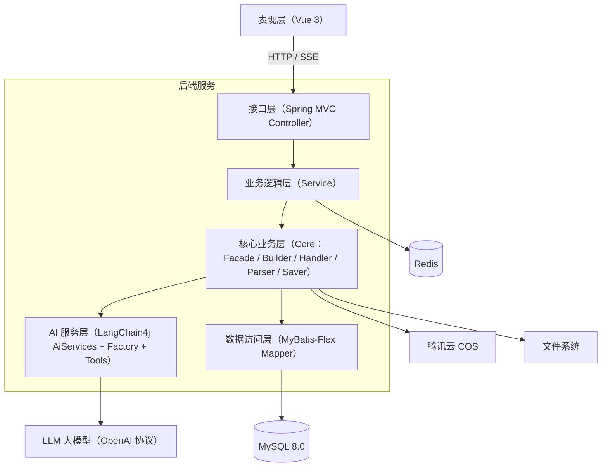

### 4.2 核心模块职责

| 模块 | 包路径 | 职责 |
| --- | --- | --- |
| AI 核心层 | `ai/` | AI 服务接口、服务工厂、智能路由、工具系统 |
| 控制层 | `controller/` | RESTful API 接口、SSE 流式推送 |
| 服务层 | `service/` | 业务逻辑（用户、应用、对话历史、截图、下载） |
| 核心业务层 | `core/` | 代码生成外观、流处理、代码解析、代码保存、Vue 项目构建 |
| 数据访问层 | `mapper/` | 数据库 CRUD 操作 |
| 通用组件 | `common/` | 统一响应体、分页请求、响应工具 |
| 权限控制 | `annotation/` + `aop/` | `@AuthCheck` 注解 + AOP 拦截器 |
| 配置层 | `config/` | CORS 跨域、COS 客户端、Redis 对话记忆等 |
| 异常处理 | `exception/` | 业务异常、全局异常处理器 |
| 对象存储 | `manager/` | COS 文件上传管理 |

### 4.3 项目目录结构

```
src/main/java/com/jamin/aicodemaster/
├── AiCodeMasterApplication.java   # 启动类
├── ai/                            # AI 核心层
│   ├── AiCodeGeneratorService.java            # AI 代码生成服务接口
│   ├── AiCodeGeneratorServiceFactory.java     # AI 服务实例工厂
│   ├── AiCodeGenTypeRoutingService.java       # 生成类型智能路由
│   ├── model/                                  # 代码结果与流式消息模型
│   └── tools/                                  # Agent 工具链
│       ├── BaseTool.java                       # 工具抽象基类
│       ├── ToolManager.java                    # 工具管理器
│       ├── FileDirReadTool.java                # 读取目录
│       ├── FileReadTool.java                   # 读取文件
│       ├── FileWriteTool.java                  # 创建文件
│       ├── FileModifyTool.java                 # 修改文件
│       └── FileDeleteTool.java                 # 删除文件
├── core/                          # 核心业务层
│   ├── AiCodeGeneratorFacade.java              # 代码生成外观
│   ├── builder/VueProjectBuilder.java          # Vue 项目构建
│   ├── handler/                                 # 流式消息处理器
│   ├── parser/                                  # 代码解析器（HTML/多文件）
│   └── saver/                                   # 代码保存器
├── controller/                    # 控制层（App / User / ChatHistory / ...）
├── service/                       # 服务层（含 impl 实现）
├── mapper/                        # 数据访问层（MyBatis-Flex）
├── model/                         # entity / dto / vo / enums
├── common/                        # 通用组件
├── annotation/                    # @AuthCheck 权限注解
├── aop/                           # AOP 权限拦截器
├── config/                        # 配置层
├── exception/                     # 异常处理
├── manager/                       # COS 对象存储管理
└── utils/                         # 工具类（WebScreenshotUtils 等）
```

---

## 五、核心业务流程

### 5.1 用户操作主流程

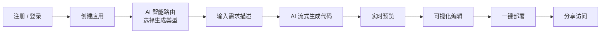

### 5.2 AI 代码生成工作流

平台针对三种生成类型分别设计了对应的生成流程，核心入口为 `AiCodeGeneratorService`。

**HTML 单文件模式**：

```
用户输入需求 → generateHtmlCodeStream()
→ AI 直接生成完整 HTML 代码 → SimpleTextStreamHandler 收集
→ HtmlCodeParser 解析 → HtmlCodeFileSaver 保存 → 实时预览
```

**多文件模式**：

```
用户输入需求 → generateMultiFileCodeStream()
→ AI 生成 index.html + style.css + script.js → SimpleTextStreamHandler 收集
→ MultiFileCodeParser 解析 → MultiFileCodeFileSaver 保存 → 实时预览
```

**Vue 工程模式（核心）**：

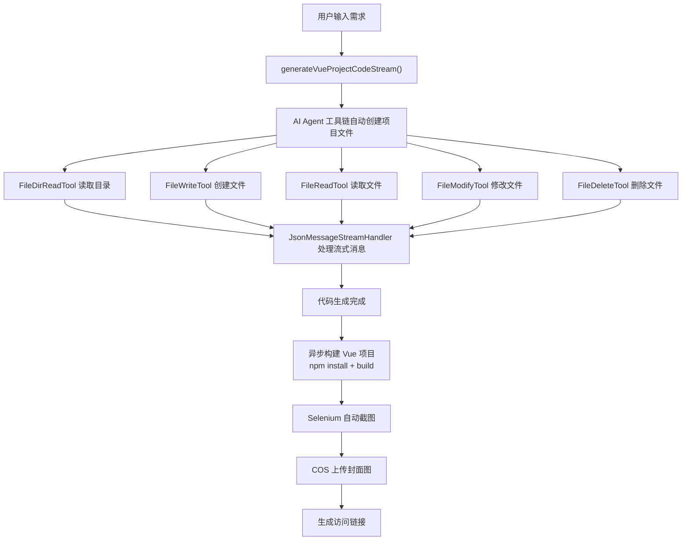

### 5.3 智能路由流程

```
用户创建应用并输入描述 → AiCodeGenTypeRoutingService
→ AI 分析需求复杂度 → 返回 CodeGenTypeEnum：
   - 简单展示页面 → HTML
   - 多页面无复杂交互 → MULTI_FILE
   - 多页面 + 复杂交互 + 数据管理 → VUE_PROJECT
→ 自动设置应用的 codeGenType
```

### 5.4 部署流程

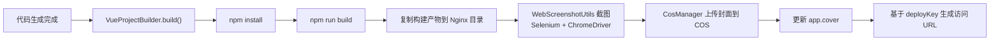

---

## 六、数据库设计

- **数据库名**：`ai_code_master`
- **表数量**：3 张核心表
- **ID 策略**：MyBatis-Flex 雪花算法
- **逻辑删除**：所有表均有 `isDelete` 字段

### 6.1 表结构

**user 表（用户表）**

| 字段 | 类型 | 约束 | 说明 |
| --- | --- | --- | --- |
| id | bigint | PK, 雪花ID | 主键 |
| userAccount | varchar(256) | NOT NULL, UK | 账号 |
| userPassword | varchar(512) | NOT NULL | 密码 |
| userName | varchar(256) | INDEX | 用户昵称 |
| userAvatar | varchar(1024) | | 头像 |
| userProfile | varchar(512) | | 简介 |
| userRole | varchar(256) | default 'user' | 角色（user/admin） |
| editTime | datetime | | 编辑时间 |
| createTime | datetime | | 创建时间 |
| updateTime | datetime | AUTO | 更新时间 |
| isDelete | tinyint | default 0 | 逻辑删除 |

**app 表（应用表）**

| 字段 | 类型 | 约束 | 说明 |
| --- | --- | --- | --- |
| id | bigint | PK, 雪花ID | 主键 |
| appName | varchar(256) | INDEX | 应用名称 |
| cover | varchar(512) | | 封面图 |
| initPrompt | text | | 初始化提示词 |
| codeGenType | varchar(64) | | 生成类型（html/multi_file/vue_project） |
| deployKey | varchar(64) | UK | 部署标识 |
| deployedTime | datetime | | 部署时间 |
| priority | int | default 0 | 优先级（精选排序） |
| userId | bigint | NOT NULL, INDEX | 创建用户ID |
| editTime | datetime | | 编辑时间 |
| createTime | datetime | | 创建时间 |
| updateTime | datetime | AUTO | 更新时间 |
| isDelete | tinyint | default 0 | 逻辑删除 |

**chat_history 表（对话历史表）**

| 字段 | 类型 | 约束 | 说明 |
| --- | --- | --- | --- |
| id | bigint | PK, 雪花ID | 主键 |
| message | text | NOT NULL | 消息内容 |
| messageType | varchar(32) | NOT NULL | 消息类型（user/ai） |
| appId | bigint | NOT NULL, INDEX | 应用ID |
| userId | bigint | NOT NULL | 用户ID |
| createTime | datetime | INDEX | 创建时间 |
| updateTime | datetime | AUTO | 更新时间 |
| isDelete | tinyint | default 0 | 逻辑删除 |

> 复合索引 `idx_appId_createTime(appId, createTime)` 用于游标分页查询。

### 6.2 E-R 关系

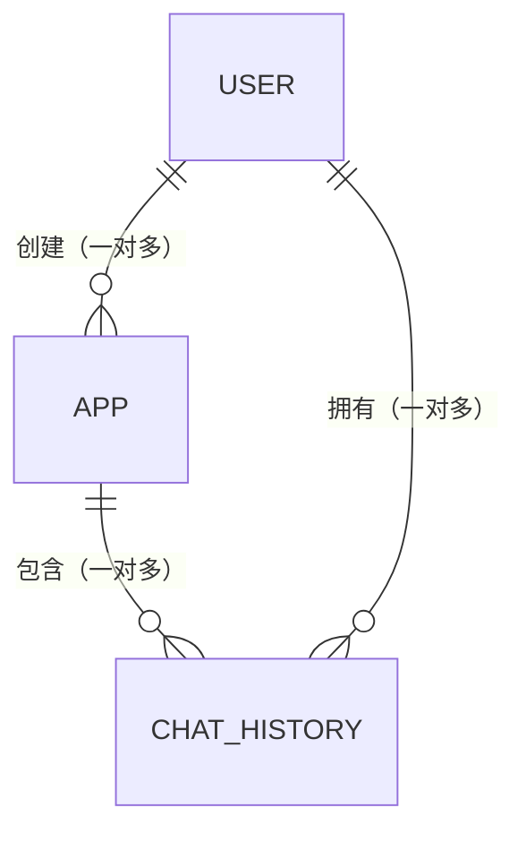

---

## 七、关键技术设计与亮点

### 7.1 工厂模式 + 多级缓存的 AI 服务管理

- `AiCodeGeneratorServiceFactory` 通过 LangChain4j 的 `AiServices.create()` 动态创建 AI 服务代理。
- 缓存键 `appId + "_" + codeGenType`，保证每个应用的每种生成类型拥有独立实例。
- Caffeine 缓存配置：`maximumSize=1000`，`expireAfterWrite=30min`，`expireAfterAccess=10min`。
- 对话记忆：`RedisChatMemoryStore` + `MessageWindowChatMemory(maxMessages=20)`。

### 7.2 Agent 工具链设计

- `BaseTool` 抽象基类定义统一接口（工具名、展示名、执行结果格式化）。
- `ToolManager` 通过 Spring 依赖注入自动收集所有工具实现，天然支持扩展新工具。
- 基于 `appId` 的文件系统隔离：`{CODE_OUTPUT_ROOT_DIR}/vue_project_{appId}/`。
- `FileDeleteTool` 内置保护列表，禁止删除 `package.json`、`vite.config.js` 等 15 个关键文件。

### 7.3 流式响应设计（SSE）

- 采用 SSE（Server-Sent Events）实现服务端到客户端的实时推送。
- 三种消息类型：`AI_RESPONSE`（AI 文本响应）、`TOOL_REQUEST`（工具调用请求）、`TOOL_EXECUTED`（工具执行结果）。
- `seenToolIds` 集合避免重复展示同一工具调用。

### 7.4 多级缓存策略

- **L1 本地缓存（Caffeine）**：AI 服务实例缓存，减少重复创建开销。
- **L2 分布式缓存（Redis）**：对话记忆持久化、Session 管理。
- 缓存失效：Caffeine 基于 TTL 自动过期，Redis 基于 LangChain4j 的 ChatMemory 管理。

### 7.5 护轨重试机制

- `hallucinatedToolNameStrategy`：处理 AI 调用「不存在工具」的情况，返回错误信息引导 AI 自我纠正，而非中断流程。
- 工具方法内部 try-catch：捕获异常后返回友好错误信息给 AI，避免异常中断整个生成链路。

### 7.6 Prompt 工程

- 4 个系统提示词模板，分别对应 HTML / 多文件 / Vue 工程 / 智能路由四类场景。
- 使用 `@SystemMessage(fromResource = "...")` 从资源文件加载，便于维护与版本化。
- Vue 工程 Prompt 约束：必须通过工具创建文件、输出 token < 20000、文件数 < 30，确保生成质量可控。